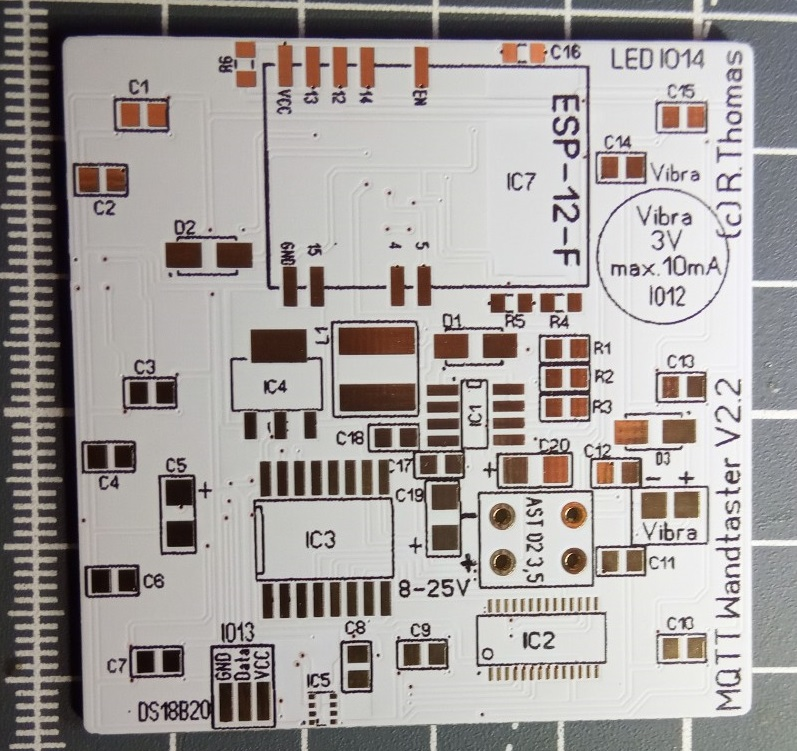
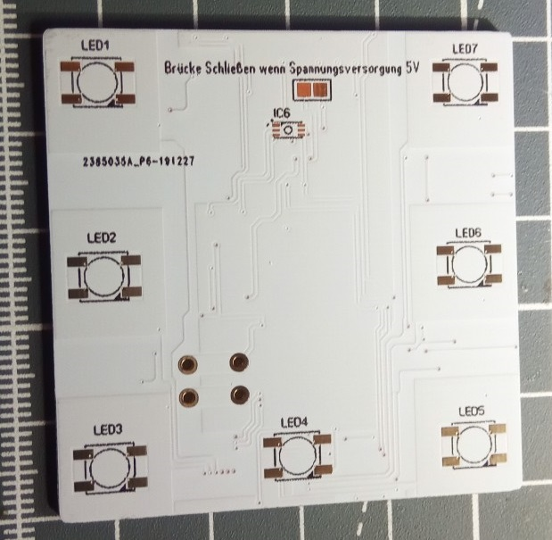
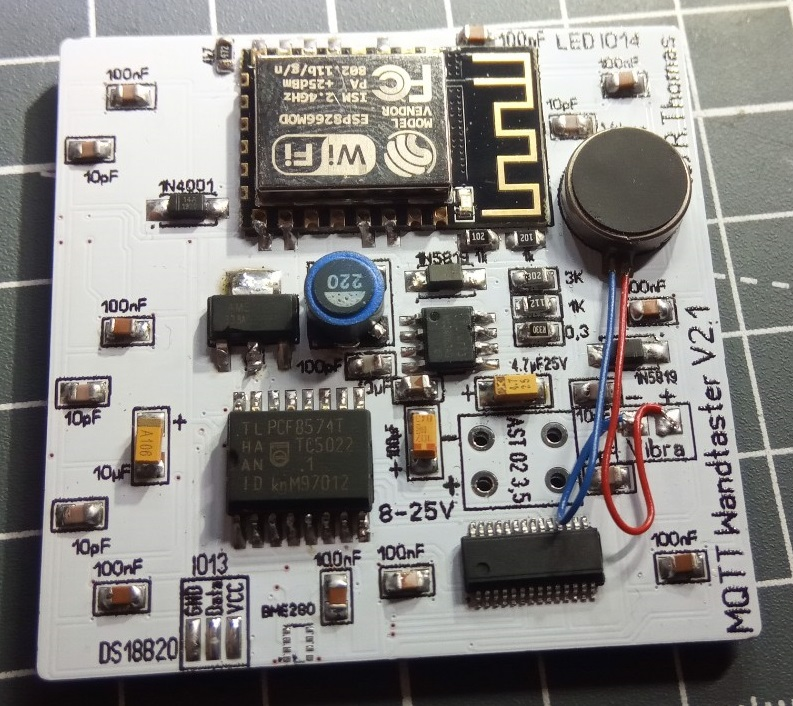
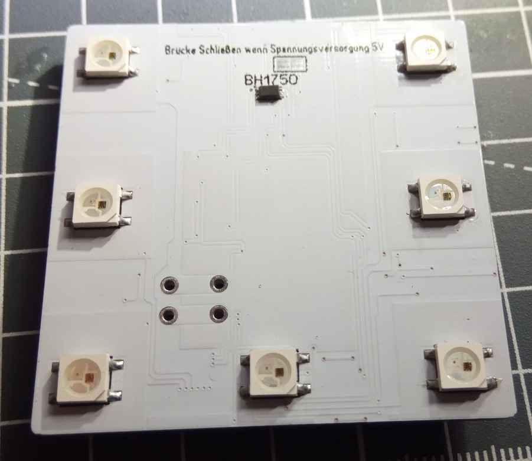

# Mqtt Wandtaster für 55iger Rahmen

## Funktionen
- 6 Toutch Taster mit ja 3 verschiedenen Belegungen (18 verschiedene aktionen möglich) 
- je Toutch Taster eine RGB LED als Status 
- Vibra als Rückmeldung 
- eine RGB LED als Nacht oder Status Licht/Anzeige 
- Lichsensor 
- Temparatur / Feuche / Luftdruck Messung 

## Anbindung
- Mittels ESP8266 und ESPEasy können Daten aus z.b. IoBrocker enfangen bzw. gesendet werden 
- Übertragung mittels Wifi 

## Stromversorgung 
8-25V DC oder 5V DC max.500mA 

## Bauteilliste komplett (Vorschlag)

| Pos      | Wert      | Bauform  | Bemerkung |
| ---      | ---       | ---      | ---       |
| D1       | 1N5819    |SOD-123   |           |
| D2       |	1N4001	 |	SOD-123 
| D3       |	1N5819	 |	SOD-123 
| C1       |	100nF	 |	0805 
| C2       | 	10pF |		0805 
|C3 |	100nF	|	0805 |
|C4 |	10pF	 |	0805  |
|C5 |	10µF |		3216	 |	Tantalum Case A	 
|C6 |	10pF	 |	0805  |
|C7 |	100nF |		0805  |
|C8 |	100nF |		0805  |
|C9 |	100nF |		0805  |
|C10 |	100nF |		0805  |
|C11 |	10pF |		0805  |
|C12 |	10pF |		0805  |
|C13 |	100nF |		0805  |
|C14 |	10pF |		0805  |
|C15 |	100nF |		0805  |
|C16 |	100nF	 |	0805  |
|C17 |	10µF |		0805  |
|C18 |	100pF	 |	0805  |
|C19 |	100µF	 |	0805	 |	Tantalum Case A 	
|C20 |	22µF 35V |	0805	 |	Tantalum Case A	 
|IC1 |	MC34063AD |	SOIC_8  |
|IC2 |	TTP226	  |	SSOP-28	 |	TTP226-809SN 
|IC3 |	PCF8574T |	SOIC-16  |
|IC4 |	AMS1117-3.3 |	SOT-223  |
|IC5 |	BME280	 |	LGA-8	 |	Heißluft nötig 
|IC6 |	BH1750FVI-TR |	WSOF-6I	 |	Lichtsensor 
|IC7 |	ESP-12-F |	 
|L1 |	22µH	 |	SMD,6x6x3mm  |min 500mA
|LED1 |	WS2812C	 |	5050  |
|LED2 |	WS2812C	 |	5050  |
|LED3 |	WS2812C	 |	5050  |
|LED4 |	WS2812C	 |	5050  |
|LED5 |	WS2812C	 |	5050  |
|LED6 |	WS2812C	 |	5050  |
|LED7 |	WS2812C	 |	5050  |
|R1 |	3k	 |	0805	 |	1/8W 
|R2 |	1k	 |	0805	 |	1/8W 
|R3 |	0,3	 |	0805	 |	1/8W 
|R4 |	1k	 |	0805	 |	1/8W 
|R5 |	1K	 |	0805	 |	1/8W 
|R6 |	4k7	 |	0805	 |	1/8W 
|Vibra  | | | 3V 
|DS18B20 |	 | |				Temp Messung
|Anschlussklemme | | |		AST 02 3,5 (Reichelt)

* für Netzteil wird benötigt (nur bei 8-25V)  
IC1
C20
C18
L1
D1
R1
R2
R3

* für Toutch wird benötigt 
IC3
IC2
C2
C4
C6
C11
C12
C14

* für LEDs wird benötigt 
LED1
LED2
LED3
LED4
LED5
LED6
LED7
C15
C13
C10
C7
C3
C1
D2

* für lichtsensor wird benötigt 
IC6
R4
R5
C16

* Temaraturmessung DS18B20 
R6
ein oder mehrfach DS18B20

* Temaratur / Feuchte / Luftdruck 
IC5
C8 
Achtung! Es wird nicht die Raumtemp gemessen sonder die Gerätetemp!!

* Vibra 
D3 
Vibra 3V

////Sollte eine oder mehrere Funktionen nicht benötigt werden können die Bauteile weggelassen werden!////

[Kontakt via Facebook](https://www.facebook.com/ronny.thomas.83)

[Kontakt via Homematic Forum](https://homematic-forum.de/forum/memberlist.php?mode=viewprofile&u=13127)

## Platine wird in Weiß und mit Vergoldeten Kontakten ausgeliefert!!! 

