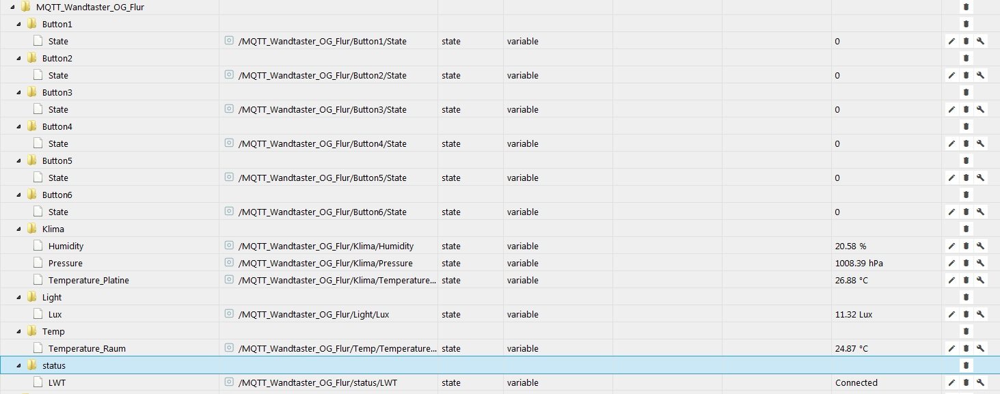
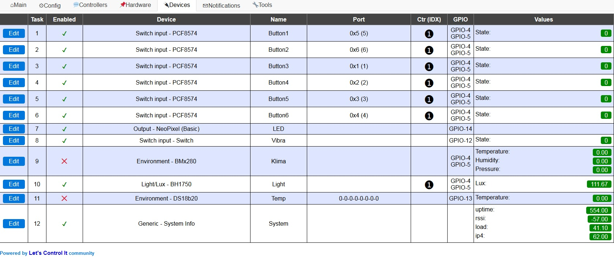
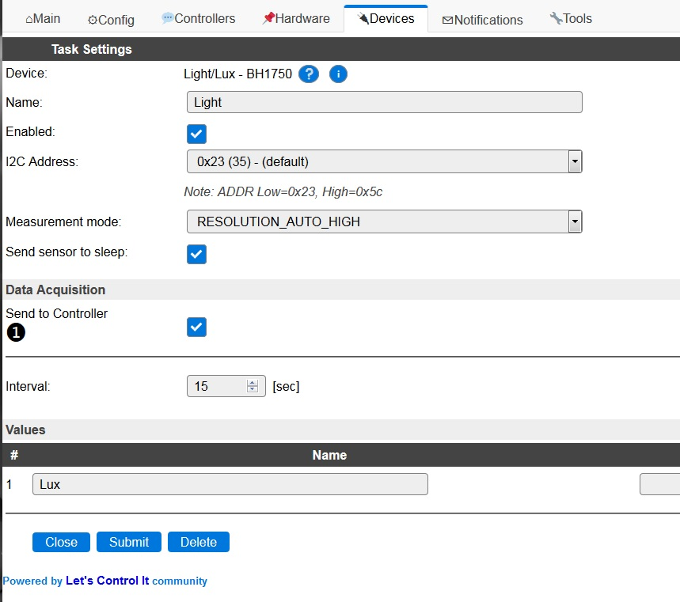

# Mqtt Wandtaster für 55iger Rahmen

## Funktionen
- 6 Toutch Taster mit ja 3 verschiedenen Belegungen (18 verschiedene aktionen möglich) 
- je Toutch Taster eine RGB LED als Status 
- Vibra als Rückmeldung 
- eine RGB LED als Nacht oder Status Licht/Anzeige 
- Lichsensor 
- Temparatur / Feuche / Luftdruck Messung 

## Anbindung
- Mittels ESP8266 und ESPEasy können Daten z.b.per MQTT aus IoBrocker enfangen bzw. gesendet werden 
- Übertragung mittels Wifi 

## Stromversorgung 
- 8-25V DC oder 5V DC max.500mA 

## Bauteilliste komplett (Vorschlag)

| Pos      | Wert      | Bauform  | Bemerkung | Link |
| ---      | ---       | ---      | ---       | --- |
| D1       | 1N5819W    |SOD-123   |           | 	[Link](https://lcsc.com/product-detail/Schottky-Barrier-Diodes-SBD_LGE-1N5819W_C402219.html)
| D2       |	1N4001	 |	SOD-123 || 		[Link](https://lcsc.com/product-detail/Diodes-General-Purpose_Shandong-Jingdao-Microelectronics-1N4001W_C162732.html)
| D3       |	1N5819W	 |	SOD-123 | |		[Link](https://lcsc.com/product-detail/Schottky-Barrier-Diodes-SBD_LGE-1N5819W_C402219.html)
| C1       |	100nF	 |	0805  || 		[Link](https://lcsc.com/product-detail/Multilayer-Ceramic-Capacitors-MLCC-SMD-SMT_Walsin-Tech-Corp-0805B104J500_C116832.html)
| C2       | 	10pF |		0805 | |[Link](https://lcsc.com/product-detail/Multilayer-Ceramic-Capacitors-MLCC-SMD-SMT_10pF-100-5-50V_C107107.html)
|C3 |	100nF	|	0805 | | [Link](https://lcsc.com/product-detail/Multilayer-Ceramic-Capacitors-MLCC-SMD-SMT_Walsin-Tech-Corp-0805B104J500_C116832.html)
|C4 |	10pF	 |	0805  | | [Link](https://lcsc.com/product-detail/Multilayer-Ceramic-Capacitors-MLCC-SMD-SMT_10pF-100-5-50V_C107107.html)
|C5 |	10µF |		3216	 |	Tantalum Case A	 | [Link](https://lcsc.com/product-detail/Tantalum-Capacitors_Hunan-Xiangyee-in-S-T-CA45-A016K106T_C119051.html) 
|C6 |	10pF	 |	0805  | | [Link](https://lcsc.com/product-detail/Multilayer-Ceramic-Capacitors-MLCC-SMD-SMT_10pF-100-5-50V_C107107.html)
|C7 |	100nF |		0805  | | [Link](https://lcsc.com/product-detail/Multilayer-Ceramic-Capacitors-MLCC-SMD-SMT_Walsin-Tech-Corp-0805B104J500_C116832.html)
|C8 |	100nF |		0805  | | [Link](https://lcsc.com/product-detail/Multilayer-Ceramic-Capacitors-MLCC-SMD-SMT_Walsin-Tech-Corp-0805B104J500_C116832.html)
|C9 |	100nF |		0805  | | [Link](https://lcsc.com/product-detail/Multilayer-Ceramic-Capacitors-MLCC-SMD-SMT_Walsin-Tech-Corp-0805B104J500_C116832.html)
|C10 |	100nF |		0805  | | [Link](https://lcsc.com/product-detail/Multilayer-Ceramic-Capacitors-MLCC-SMD-SMT_Walsin-Tech-Corp-0805B104J500_C116832.html)
|C11 |	10pF |		0805  | | [Link](https://lcsc.com/product-detail/Multilayer-Ceramic-Capacitors-MLCC-SMD-SMT_10pF-100-5-50V_C107107.html)
|C12 |	10pF |		0805  | | [Link](https://lcsc.com/product-detail/Multilayer-Ceramic-Capacitors-MLCC-SMD-SMT_10pF-100-5-50V_C107107.html)
|C13 |	100nF |		0805  | | [Link](https://lcsc.com/product-detail/Multilayer-Ceramic-Capacitors-MLCC-SMD-SMT_Walsin-Tech-Corp-0805B104J500_C116832.html)
|C14 |	10pF |		0805  | |[Link](https://lcsc.com/product-detail/Multilayer-Ceramic-Capacitors-MLCC-SMD-SMT_10pF-100-5-50V_C107107.html)
|C15 |	100nF |		0805  | | [Link](https://lcsc.com/product-detail/Multilayer-Ceramic-Capacitors-MLCC-SMD-SMT_Walsin-Tech-Corp-0805B104J500_C116832.html)
|C16 |	100nF	 |	0805  | | [Link](https://lcsc.com/product-detail/Multilayer-Ceramic-Capacitors-MLCC-SMD-SMT_Walsin-Tech-Corp-0805B104J500_C116832.html)
|C17 |	10µF |		0805  | | [Link](https://lcsc.com/product-detail/Others_Samsung-Electro-Mechanics_CL21A106KQFNNNE_Samsung-Electro-Mechanics-CL21A106KQFNNNE_C307525.html)
|C18 |	100pF	 |	0805  | | [Link](https://lcsc.com/product-detail/Multilayer-Ceramic-Capacitors-MLCC-SMD-SMT_SAMSUNG_CL21C101JBANNNC_100pF-101-5-50V_C1790.html)
|C19 |	100µF	 |	3216	 |	Tantalum Case A  | [Link](https://lcsc.com/product-detail/Tantalum-Capacitors_Hunan-Xiangyee-in-S-T-CA45-A6R3K107T_C435293.html)	
|C20 |	22µF 35V |	3216	 |	Tantalum Case A	  | [Link](https://lcsc.com/product-detail/Tantalum-Capacitors_Hunan-Xiangyee-in-S-T-CA45-D035K226T_C126947.html)
|IC1 |	MC34063AD |	SOIC_8  |  | [Link](https://lcsc.com/product-detail/DC-DC-Converters_HTC-Korea-TAEJIN-Tech-MC34063AD_C118241.html)
|IC2 |	TTP226	  |	SSOP-28	 |	TTP226-809SN | [Link](https://lcsc.com/product-detail/Touch-Screen-Controller-ICs_Tontek-Design-Tech-TTP226-809SN_C183531.html) Habe ggf noch welche da.
|IC3 |	PCF8574T |	 SOIC-16_300mil  | 	PCF8574T/3,518  | [Link](https://lcsc.com/product-detail/Interface-I-O-Expanders_NXP-Semicon-PCF8574T-3-518_C7605.html)
|IC4 |	AMS1117-3.3 |	SOT-223  |  | [Link](https://lcsc.com/product-detail/Low-Dropout-Regulators-LDO_Slkor-SLKORMICRO-Elec-AMS1117-3-3_C426566.html)
|IC5 |	BME280	 |	LGA-8	 |	Heißluft nötig  | [Link](https://lcsc.com/product-detail/Humidity-Sensors_Bosch-Sensortec-BME280_C92489.html)
|IC6 |	BH1750FVI-TR |	WSOF-6I	 |	Lichtsensor  | [Link](https://lcsc.com/product-detail/Ambient-Light-Sensors_ROHM-Semicon-BH1750FVI-TR_C78960.html)
|IC7 |	ESP-12-F |	| | [Link](https://lcsc.com/product-detail/WIFI-Modules_ESP-12F-ESP8266MOD_C82891.html) 
|L1 |	22µH	 |	SMD,6x6x3mm  |min 500mA  | [Link](https://lcsc.com/product-detail/Power-Inductors_TDK-SLF6045T-220M1R1-3PF_C92043.html)
|LED1 |	WS2812C	 |	5050  | | [Link](https://lcsc.com/product-detail/Light-Emitting-Diodes-LED_Worldsemi-WS2812C_C114587.html)
|LED2 |	WS2812C	 |	5050  | | [Link](https://lcsc.com/product-detail/Light-Emitting-Diodes-LED_Worldsemi-WS2812C_C114587.html)
|LED3 |	WS2812C	 |	5050  | | [Link](https://lcsc.com/product-detail/Light-Emitting-Diodes-LED_Worldsemi-WS2812C_C114587.html)
|LED4 |	WS2812C	 |	5050  | | [Link](https://lcsc.com/product-detail/Light-Emitting-Diodes-LED_Worldsemi-WS2812C_C114587.html)
|LED5 |	WS2812C	 |	5050  | | [Link](https://lcsc.com/product-detail/Light-Emitting-Diodes-LED_Worldsemi-WS2812C_C114587.html)
|LED6 |	WS2812C	 |	5050  | | [Link](https://lcsc.com/product-detail/Light-Emitting-Diodes-LED_Worldsemi-WS2812C_C114587.html)
|LED7 |	WS2812C	 |	5050  | | [Link](https://lcsc.com/product-detail/Light-Emitting-Diodes-LED_Worldsemi-WS2812C_C114587.html)
|R1 |	3k	 |	0805	 |	1/8W | [Link](https://lcsc.com/product-detail/Chip-Resistor-Surface-Mount_UNI-ROYAL-Uniroyal-Elec-0805W8J0302T5E_C25633.html)
|R2 |	1k	 |	0805	 |	1/8W | [Link](https://lcsc.com/product-detail/Chip-Resistor-Surface-Mount_UNI-ROYAL-Uniroyal-Elec-0805W8J0102T5E_C25623.html)
|R3 |	0,3	 |	0805	 |	1/8W  | [Link](https://lcsc.com/product-detail/Chip-Resistor-Surface-Mount_0-03R-R030-1_C158159.html)
|R4 |	1k	 |	0805	 |	1/8W | [Link](https://lcsc.com/product-detail/Chip-Resistor-Surface-Mount_UNI-ROYAL-Uniroyal-Elec-0805W8J0102T5E_C25623.html)
|R5 |	1K	 |	0805	 |	1/8W | [Link](https://lcsc.com/product-detail/Chip-Resistor-Surface-Mount_UNI-ROYAL-Uniroyal-Elec-0805W8J0102T5E_C25623.html)
|R6 |	4k7	 |	0805	 |	1/8W  | [Link](https://lcsc.com/product-detail/Chip-Resistor-Surface-Mount_4-7KR-472-5_C104350.html)
|Vibra  | | | 3V  | [Link](https://de.aliexpress.com/item/32664414295.html?spm=a2g0o.productlist.0.0.663719b5eaxpAb&algo_pvid=2b26df5c-cf5e-46b2-b3b7-cf34572e0421&algo_expid=2b26df5c-cf5e-46b2-b3b7-cf34572e0421-11&btsid=d8b92c4b-5c7e-4afd-bff9-2a57968d0697&ws_ab_test=searchweb0_0,searchweb201602_10,searchweb201603_55)
|DS18B20 |	 | |				Temp Messung  | [Link](https://lcsc.com/product-detail/Temperature-Sensors_UMW-Youtai-Semiconductor-Co-Ltd-DS18B20_C376006.html)
|Anschlussklemme | | |		AST 02 3,5 (Reichelt)  | [Link](https://lcsc.com/product-detail/Pluggable-System-Terminal-Block_METZ-CONNECT-GmbH-AST2130202_C123248.html)

Alles Links ohne Gewähr! Leider habe ich keine Lieferant gefunden der in DE alle Teile hat deshalb dieser aus China.

* für Netzteil wird benötigt (nur bei 8-25V)  
IC1
C20
C18
L1
D1
R1
R2
R3

* für Toutch wird benötigt 
IC3
IC2
C2
C4
C6
C11
C12
C14

* für LEDs wird benötigt 
LED1
LED2
LED3
LED4
LED5
LED6
LED7
C15
C13
C10
C7
C3
C1
D2

* für lichtsensor wird benötigt 
IC6
R4
R5
C16

* Temaraturmessung DS18B20 
R6
ein oder mehrfach DS18B20 ausserhalb des Geheuses Platzieren!

* Temaratur / Feuchte / Luftdruck 
IC5
C8 
Achtung! Es wird nicht die Raumtemp gemessen sonder die Gerätetemp!!

* Vibra 
D3 
Vibra 3V

////Sollte eine oder mehrere Funktionen nicht benötigt werden können die Bauteile weggelassen werden!////

[Kontakt via Facebook](https://www.facebook.com/ronny.thomas.83)

[Kontakt via Homematic Forum](https://homematic-forum.de/forum/memberlist.php?mode=viewprofile&u=13127)

## Platine wird in Weiß und mit Vergoldeten Kontakten ausgeliefert!!! 

